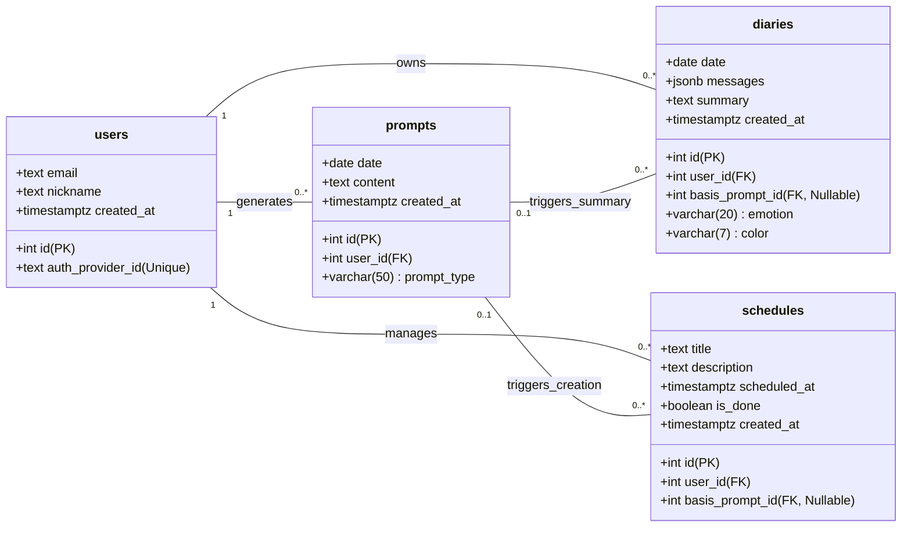

# 데이터베이스 설계도

```mermaid
classDiagram
    direction LR
    
    class users {
        +int id (PK)
        +text auth_provider_id (Unique)
        +text email
        +text nickname
        +timestamptz created_at
    }

    class diaries {
        +int id (PK)
        +int user_id (FK)
        +int basis_prompt_id (FK, Nullable)
        +date date
        +jsonb messages
        +text summary
        +varchar(20) emotion
        +varchar(7) color
        +timestamptz created_at
    }

    class schedules {
        +int id (PK)
        +int user_id (FK)
        +int basis_prompt_id (FK, Nullable)
        +text title
        +text description
        +timestamptz scheduled_at
        +boolean is_done
        +timestamptz created_at
    }

    class prompts {
        +int id (PK)
        +int user_id (FK)
        +date date
        +text content
        +varchar(50) prompt_type
        +timestamptz created_at
    }

    %% 관계 설정 (사용자가 없어도 존재할 수 있는 Optional 관계 반영)
    users "1" -- "0..*" diaries : owns
    users "1" -- "0..*" schedules : manages
    users "1" -- "0..*" prompts : generates
    
    %% Prompts에 의한 트리거 관계 (일정 및 일기 생성의 근거)
    prompts "0..1" -- "0..*" schedules : triggers_creation
    prompts "0..1" -- "0..*" diaries : triggers_summary

```