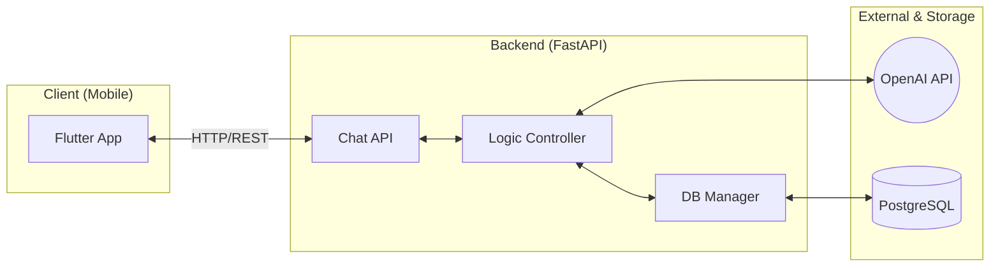

```mermaid
graph LR
    subgraph "Client (Mobile)"
        A[Flutter App]
    end

    subgraph "Backend (FastAPI)"
        B[Chat API]
        C[Logic Controller]
        D[DB Manager]
    end

    subgraph "External & Storage"
        E((OpenAI API))
        F[(PostgreSQL)]
    end

    A <-->|HTTP/REST| B
    B <--> C
    C <--> E
    C <--> D
    D <--> F
```